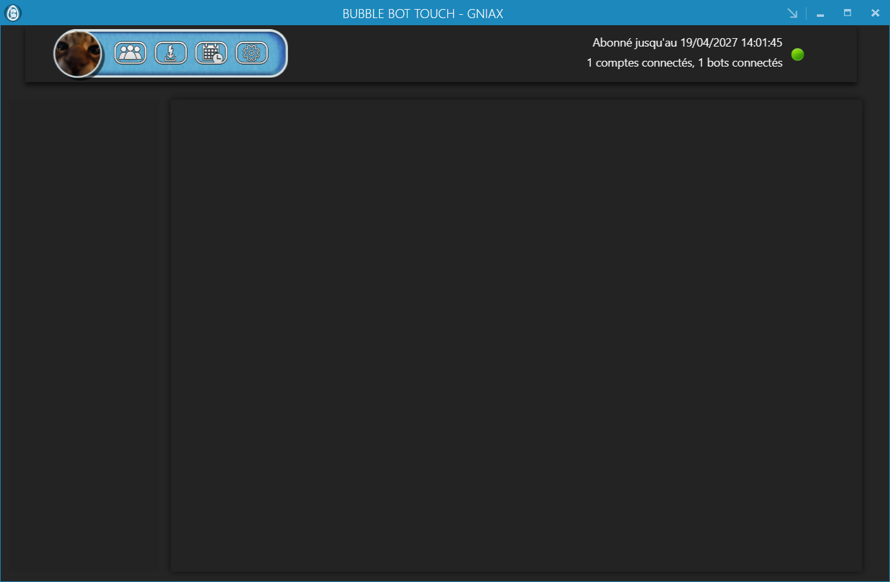
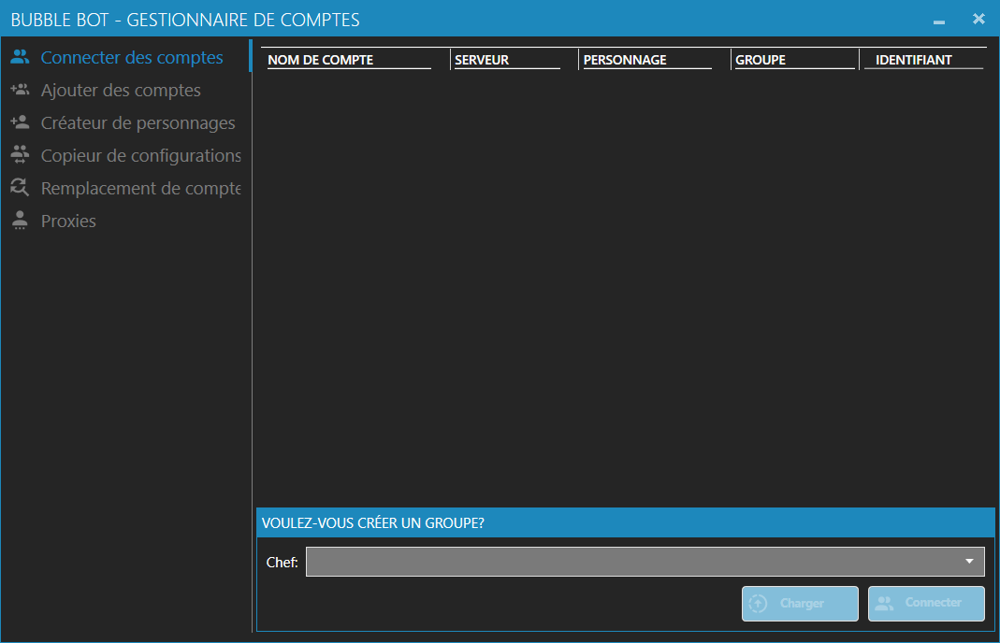
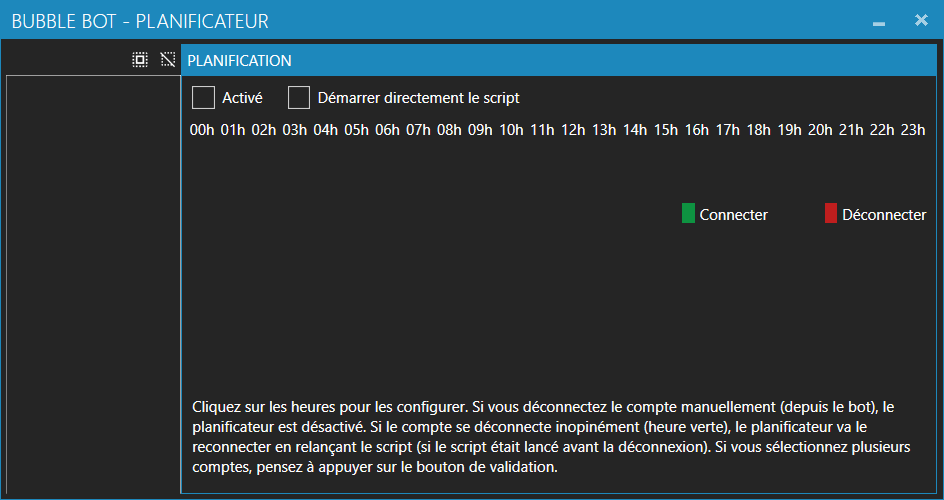
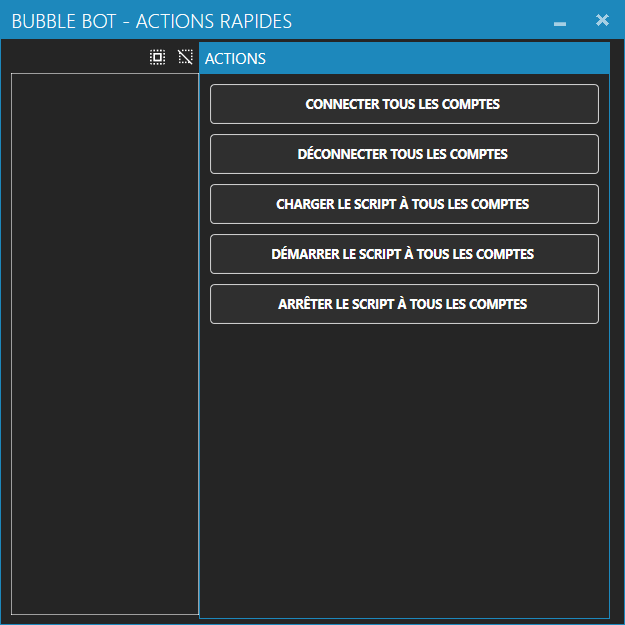
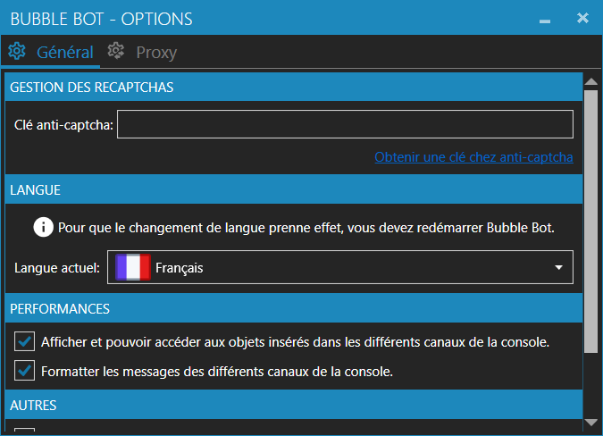

# Bubble Bot

Automation platform for Dofus Touch, built in 2020: a WPF desktop client driving many accounts at once, a hand-written protocol layer, a licensing server, a customer website and a REST API.

Archived as-is for reference. It is not maintained, and the Dofus Touch protocol it targets has moved on since.



## Components

| Project | Role |
| --- | --- |
| `BubbleBot.WPF` | Desktop client: account manager, scripting, pathfinding, fight engine, planner |
| `BubbleBot.Protocol` | Network layer: 899 generated messages, typed serialisation, enums and data classes |
| `BubbleBot.Server` | Licensing and session server the clients connect to |
| `BubbleBot.Website` | ASP.NET Core customer site: accounts, subscriptions, extensions, payments |
| `BubbleBot.Api` | REST API shared by the client and the site |
| `BubbleBot.AccountGenerator` | Automated account creation over a headless browser |
| `AntiRecaptcha` | Captcha-solving service client used by the generator |

## Desktop client

Written in C# / WPF on .NET Framework 4.8, MVVM with custom converters and controls.

- runs several accounts in parallel, grouped, with a leader driving the group;
- LUA-like scripting: fight rules, gathering, movement, exchange between characters;
- built-in pathfinding, fight decision engine and map awareness;
- per-account options, proxy assignment and character creation;
- scheduler for time-based actions, live logs per account.

<p align="center">
  
  
</p>
<p align="center">
  
  
</p>

## Protocol layer

`BubbleBot.Protocol` is the interesting part: 899 message types, 250 protocol types, 96 enums and the matching serialisation, all mapped to the Dofus Touch binary protocol. Messages are read and written from raw frames, then dispatched to handlers in the client and the server.

## Backend

The website and API run on ASP.NET Core 3.1 with MySQL: user accounts, subscription plans, per-feature extensions bought with points, PayPal transactions and character archiving. The server project handles client sessions and licence checks.

## Build

Requires Visual Studio 2019+ with .NET Framework 4.8 and the .NET Core 3.1 SDK.

```bash
git clone https://github.com/gniax/bubble-bot.git
# open BubbleBot.sln, restore NuGet packages, build
```

The website and API need a MySQL database and their own configuration. Copy `BubbleBot.Api/appsettings.example.json` to `appsettings.json` and fill in your own values — every credential in this repository is a placeholder (`CHANGE_ME`), none of them work.

## Status and licence

Public archive of a finished project. The code targets a 2020 Dofus Touch client and automating that game breaks Ankama's terms of service, so this is published for the architecture, not for use.

MIT, see [LICENSE](LICENSE).

Built with [@Mamar-dev](https://github.com/Mamar-dev).
